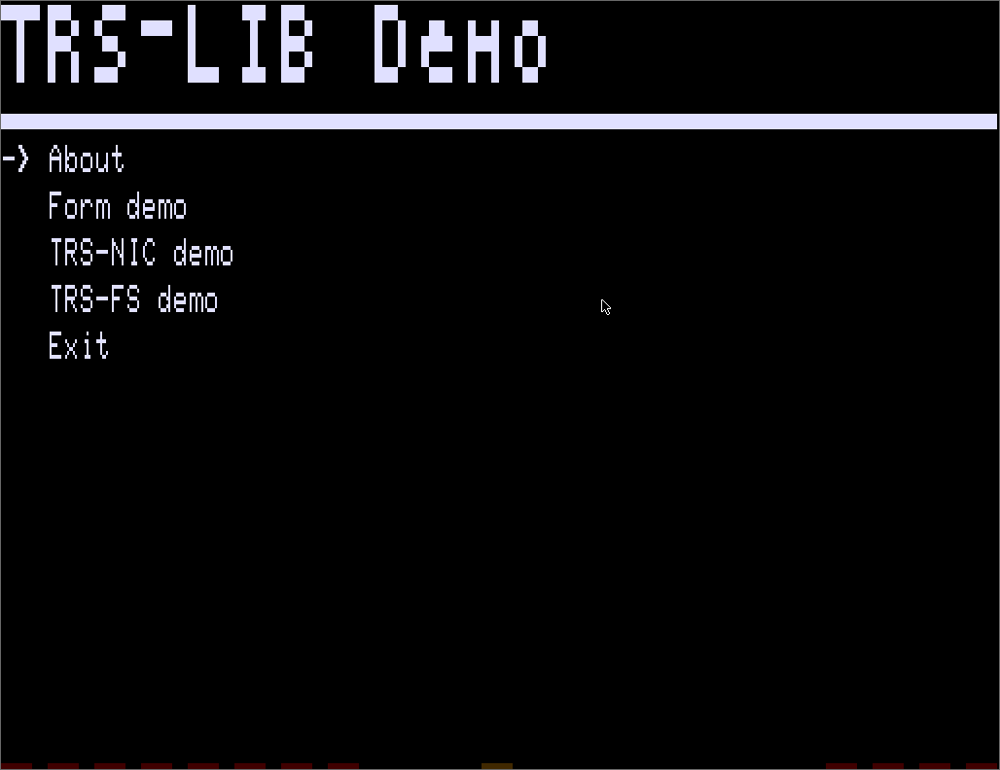

# TRS-LIB

TRS-LIB is a small, C-based library that offers simple UI elements for TRS-80 applications.
The Small Devices C Compiler (sdcc 4.2.0) can be used to generate CMD executables that run on a standard TRS-80.
TRS-LIB offers a C-API for TRS-IO to easily use Internet sockets (TRS-NIC) and POSIX-style file access (TRS-FS).
Below is a screen capture to show some of its features.



Among TRS-LIB features are:

* <a href="demo/main.c">Menus</a>
* <a href="demo/demo-form.c">Forms</a>
* <a href="demo/demo-trs-nic.c">TRS-NIC API</a>
* <a href="demo/demo-trs-fs.c">TRS-FS API</a>

Download a pre-compiled <a href="var/DEMO.CMD">CMD</a> to run a demo on a TRS-80 Model 1 or MIII. Note that
a TRS-IO card is required for TRS-NIC and TRS-FS.

TRS-LIB can be compiled on a host using:

```
git clone https://github.com/apuder/TRS-LIB.git
cd TRS-LIB
make
```
